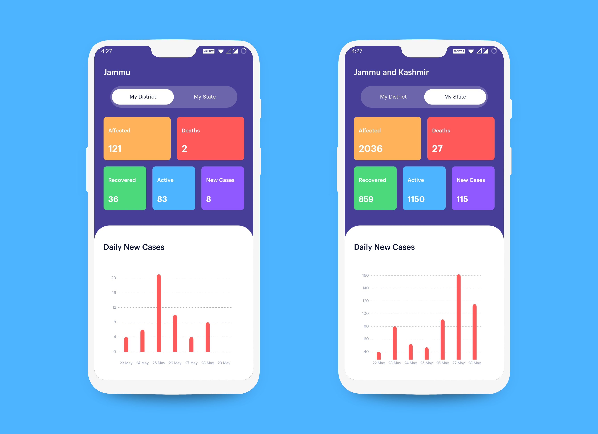

# Covid Tracker Android app
 
   

 
  

## Features
- Auto detects district and state using device's current location.
- Daily new cases in last 7 days for both state and district.
- Total active, confirmed, recovered and deaths in both state and district.
- Offline caching.
 
  

 
  

- Java 
- MVVM
- Data Binding
- MPChart https://github.com/PhilJay/MPAndroidChart
- RetroFit2 https://square.github.io/retrofit/
- Reverse Geocoding https://www.mapmyindia.com/api/advanced-maps/doc/reverse-geocoding-api

## Credits 
Thanks https://dribbble.com/simantoo for the beautiful design!  
https://dribbble.com/shots/11015463-Covid-19-App-Free
